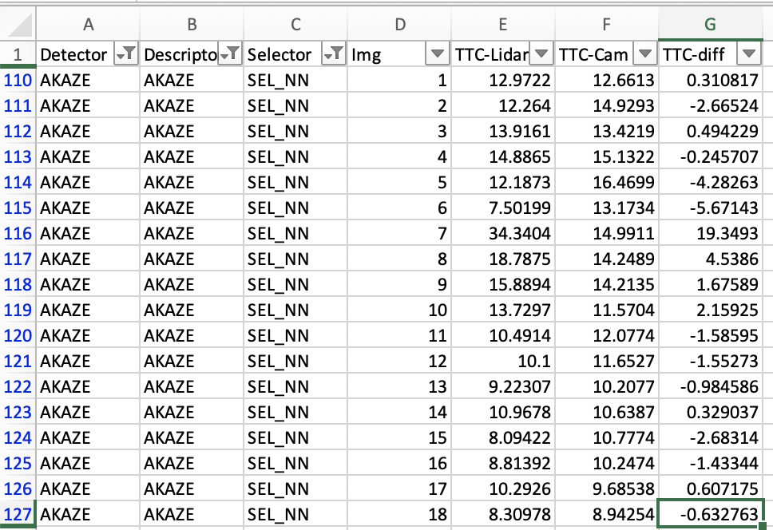
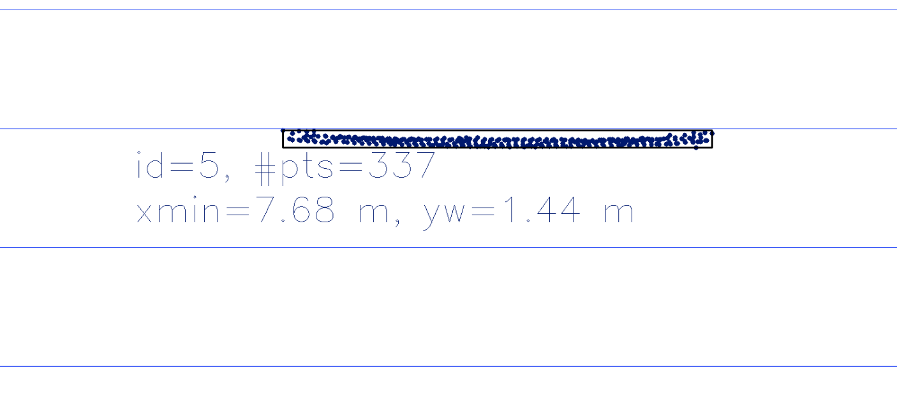
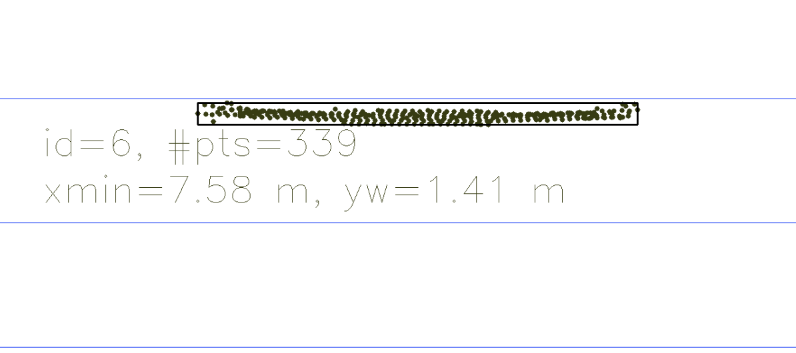
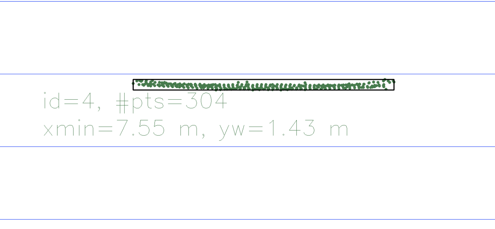

# SFND 3D Object Tracking

Welcome to the final project of the camera course. By completing all the lessons, you now have a solid understanding of keypoint detectors, descriptors, and methods to match them between successive images. Also, you know how to detect objects in an image using the YOLO deep-learning framework. And finally, you know how to associate regions in a camera image with Lidar points in 3D space. Let's take a look at our program schematic to see what we already have accomplished and what's still missing.

In this final project, you will implement the missing parts in the schematic. To do this, you will complete four major tasks: 
1. First, you will develop a way to match 3D objects over time by using keypoint correspondences. 
2. Second, you will compute the TTC based on Lidar measurements. 
3. You will then proceed to do the same using the camera, which requires to first associate keypoint matches to regions of interest and then to compute the TTC based on those matches. 
4. And lastly, you will conduct various tests with the framework. Your goal is to identify the most suitable detector/descriptor combination for TTC estimation and also to search for problems that can lead to faulty measurements by the camera or Lidar sensor. In the last course of this Nanodegree, you will learn about the Kalman filter, which is a great way to combine the two independent TTC measurements into an improved version which is much more reliable than a single sensor alone can be. But before we think about such things, let us focus on your final project in the camera course. 

## Dependencies for Running Locally
* cmake >= 2.8
  * All OSes: [click here for installation instructions](https://cmake.org/install/)
* make >= 4.1 (Linux, Mac), 3.81 (Windows)
  * Linux: make is installed by default on most Linux distros
  * Mac: [install Xcode command line tools to get make](https://developer.apple.com/xcode/features/)
  * Windows: [Click here for installation instructions](http://gnuwin32.sourceforge.net/packages/make.htm)
* Git LFS
  * Weight files are handled using [LFS](https://git-lfs.github.com/)
* OpenCV >= 4.1
  * This must be compiled from source using the `-D OPENCV_ENABLE_NONFREE=ON` cmake flag for testing the SIFT and SURF detectors.
  * The OpenCV 4.1.0 source code can be found [here](https://github.com/opencv/opencv/tree/4.1.0)
* gcc/g++ >= 5.4
  * Linux: gcc / g++ is installed by default on most Linux distros
  * Mac: same deal as make - [install Xcode command line tools](https://developer.apple.com/xcode/features/)
  * Windows: recommend using [MinGW](http://www.mingw.org/)

## Basic Build Instructions

1. Clone this repo.
2. Make a build directory in the top level project directory: `mkdir build && cd build`
3. Compile: `cmake .. && make`
4. Run it: `./3D_object_tracking`.

## Project Report
### FP.1.
DMatch data type has queryIdx and trainIdx that are index of keypoint in previous and current frame respectively. Idea is to extract bounding boxes for each match in both current and previous frame. Then consider all possible match pairs of current and previous matching boxes and find most occuring pair.

### FP.2.
Lidar Points can accurately reflect closest points of an object. However, there is a chance of a noise in the environment where few lidar points in the cloud could reflect non-obstacle substances. These could lead into an incorrect TTC computation which can result in a spurious alarms and autonomous braking (not desired). In order to overcome this, Lidar points were sorted by X axis and projected onto. If there is a lidar point closer than actual proceeding vehicle, then the distance between that point and next closest lidar point on the obstacle would be larger than the standard deviation. If so, it is a noise, otherwise it is a valid lidar point. Note that this approach strictly assumes that noisy lidar points are scattered and distance between them are not closer than distance between lidar points of true object.
The rest of the calculation follows same approach taken during the practice exercises.
See function filterLidarOutliers() function.

### FP.3.
In general, we need to check if specified bounding box contains given keypoints. However, outlier matches need to be eliminated for more accurate TTC computation. In this function, the standard deviation of distance between matched keypoints is calculated. Any match that deviates more than that is ignored.

### FP.4.
This part has been done during practice exercises. To reduce TTC errors further, median of distance ratios between matching keypoints is used.

### FP.5 and FP.6
One of the best results was obtained by running AKAZE detector with AKAZE descriptor.

For most of the frames, results vary between 0 to 3 seconds. However, for frames 5, 6, 7, 8 the delta between TTCs were at least 4 seconds, and for frame 7 it was 19 seconds. Looking at the top-down view of frame 6 and 7, I see that most of the outliers have been removed.

Frame 5 to Frame 6

Frame 6 to Frame 7

The change in minX from frame 6 to frame 7 is so small that TTC with constant velocity model is high. Initially, assumed filtering function mistakenly removed inlier points but found out that it actually did not by comparing results without filtering.
If TTC Lidar deduces 34 while Camera deduces 15, this means approximately, the minXCurr - minXPrev must be twice as big to get the results closer. None of the filtered points could explain missing points.
Other reasons to the error could be calibration errors? What if the camera frame does not really match the lidar point cloud for that frame?
At this point, I was not able to explain the reason behind it.

Detectors such as ORB and HARRIS were least performing with huge amount of errors. ORB detector and descriptor had many false matches and filtering them leaves the bounding box with no matches at all. Hence, end result is either NaN or way off the expected.

